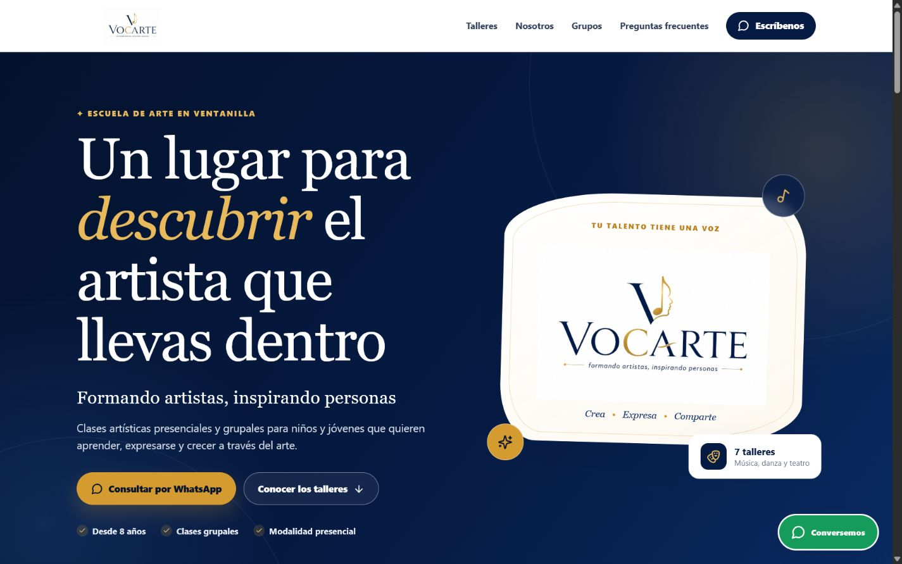
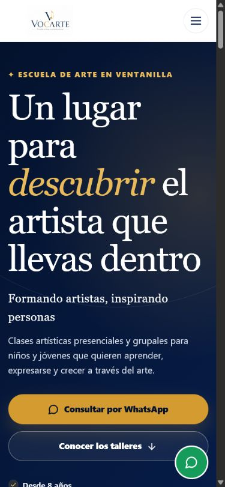

# Vocarte — Landing Page

**Vocarte** es una escuela de arte para niños y jóvenes ubicada en Ventanilla, Perú. Esta landing page presenta sus talleres artísticos, los grupos organizados por edades, los beneficios de la formación, preguntas frecuentes y medios de contacto.

El proyecto responde a una necesidad real de captación e información para potenciales alumnos y sus familias. Es la primera versión funcional del ecosistema tecnológico de Vocarte y establece una base pública que puede evolucionar junto con la escuela.

## Demo en vivo

[Ver sitio web de Vocarte](https://andresolivertrujillo.github.io/vocarte-landing-page/)

## Vista previa

### Escritorio



### Móvil



## Mi participación

Fui responsable del desarrollo tecnológico de esta primera versión. Mi trabajo comprendió:

- Definición de la estructura inicial de la landing page.
- Desarrollo de la interfaz con React y TypeScript.
- Implementación del diseño responsive.
- Centralización de la información editable del negocio.
- Integración de accesos de contacto mediante WhatsApp.
- Configuración del despliegue mediante GitHub Pages.
- Corrección de problemas visuales y adaptación del logotipo oficial para su uso en la interfaz.

El logotipo es un recurso oficial proporcionado por Vocarte. Mi participación se limitó a su integración y adaptación técnica dentro del sitio.

## Problema y solución

### Problema

Vocarte necesitaba una presencia digital inicial donde las familias pudieran conocer su propuesta educativa, los talleres disponibles y las formas de contacto sin depender de información dispersa.

### Solución

Se desarrolló una landing page responsive, rápida y fácil de actualizar que organiza la información principal de la escuela, facilita la exploración por edades y talleres, y dirige las consultas hacia WhatsApp. La solución crea un punto de contacto digital claro y una base técnica para futuras funcionalidades.

## Funcionalidades

- Presentación de los talleres artísticos.
- Organización de la información por grupos de edades.
- Secciones de beneficios y preguntas frecuentes.
- Navegación responsive para escritorio y dispositivos móviles.
- Botones de contacto mediante WhatsApp.
- Configuración centralizada de la información del negocio.
- Despliegue público mediante GitHub Pages.

## Tecnologías

- React
- TypeScript
- Vite
- CSS responsive
- Lucide React para iconografía
- GitHub Actions y GitHub Pages

## Instalación y ejecución local

Requisitos: Node.js 20 o superior y npm.

```bash
git clone https://github.com/andresolivertrujillo/vocarte-landing-page.git
cd vocarte-landing-page
npm ci
npm run dev
```

Vite mostrará la dirección local para abrir la página en el navegador.

## Compilación de producción

```bash
npm run typecheck
npm run build
npm run preview
```

La compilación optimizada se genera en `dist/`.

## Despliegue

El proyecto se publica automáticamente en GitHub Pages mediante el workflow:

`.github/workflows/deploy-pages.yml`

Cada actualización de `main` ejecuta la instalación, el typecheck y el build antes de desplegar el contenido de `dist/`. La ruta base se configura en `vite.config.ts` para el subdirectorio `/vocarte-landing-page/`.

## Configuración de la información del negocio

Los datos editables están centralizados en:

`src/config/business.ts`

Desde ese archivo se pueden actualizar:

- Número y mensaje inicial de WhatsApp.
- Nombre, lema y ubicación.
- Enlaces de navegación.
- Nombres y descripciones de los talleres.

### Cambiar el número de WhatsApp

Busca esta propiedad:

```ts
number: '519XXXXXXXX'
```

Reemplázala por el número real con código de país, sin `+`, espacios ni guiones. El formato esperado es `51` seguido por los nueve dígitos del celular. Todos los botones de la página utilizan esta única configuración.

## Logotipo oficial

- `LOGO.jpeg` es el archivo original oficial y debe conservarse intacto.
- `public/logo-vocarte.jpeg` es una copia exacta, idéntica byte por byte, utilizada por la web.
- La misma copia oficial se usa temporalmente como favicon e imagen para compartir el enlace.

No recortes, recomprimas, conviertas, deformes ni recolorees estos archivos. En el futuro se puede solicitar una versión cuadrada oficial para el favicon y una tarjeta social aprobada por Vocarte, pero el proyecto no genera ni utiliza versiones alternativas de la marca.

Para sustituir el logotipo, actualiza tanto `LOGO.jpeg` como su copia exacta `public/logo-vocarte.jpeg` y confirma que ambos archivos tengan el mismo hash SHA-256.

## Información pendiente

- Número real de WhatsApp.
- Dirección exacta, solo si se decide publicarla.
- Horarios, precios y disponibilidad confirmados.
- Perfiles oficiales de redes sociales.
- Fotografías propias autorizadas.

El proyecto no inventa estos datos y actualmente no incluye backend, formulario, pagos ni sistema de inscripción.

## Evolución prevista

Las siguientes funcionalidades forman parte de posibles etapas futuras y todavía no están implementadas:

- Formularios o sistema de inscripción.
- Integración con una plataforma para alumnos.
- Publicación de cursos grabados.
- Analítica de visitas y conversiones.
- Integración de redes sociales oficiales.
